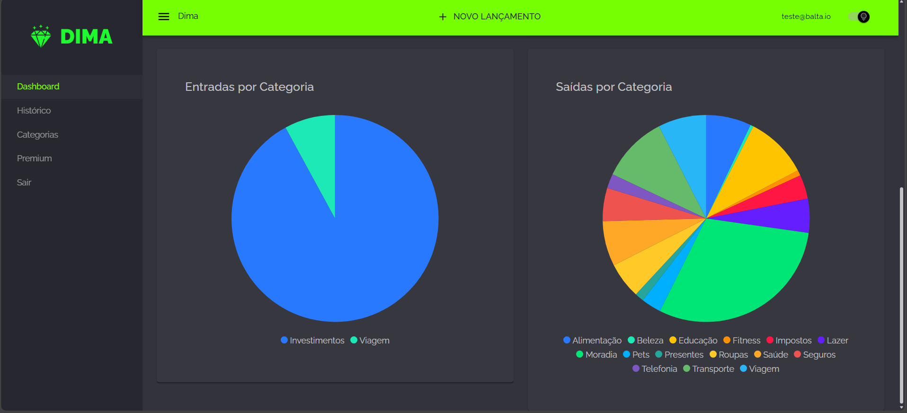

# dima

Aplicação de controle financeiro desenvolvida com Blazor WebAssembly no frontend e Minimal APIs no backend, utilizando a plataforma .NET.

O projeto foi desenvolvido durante o curso Fullstack .NET do <a href="https://balta.io/">balta.io</a>, servindo como prática de conceitos de desenvolvimento web com .NET, arquitetura em camadas e integração entre frontend e backend.



## Tecnologias


## Funcionalidades

- Autenticação utilizando ASP.NET Identity
- Cadastro de receitas e despesas
- Controle de transações financeiras
- Dashboard para visualização dos dados
- API REST utilizando Minimal API
- Interface construída com MudBlazor
- Documentação da API com Swagger
- Simulação de pagamento via <a href="https://stripe.com">Stripe</a>

## Estrutura do projeto

```text
    Dima/
    ├── Dima.Api   # Backend (Minimal APIs)
    ├── Dima.Core  # Classlib
    └── Dima.Web   # Frontend Blazor WebAssembly
```

## Para rodar localmente

### Requisitos

- [.NET 10](https://dotnet.microsoft.com/pt-br/download/dotnet/10.0)
- [Docker](https://www.docker.com/) (opcional, para subir o SQL Server)
- [SQL Server Management Studio](https://learn.microsoft.com/pt-br/ssms/install/install) (caso utilize sem Docker)

---

### Configuração de Segredos

Este projeto utiliza o `dotnet user-secrets` para armazenar informações sensíveis localmente.

#### Connection String

Inicialize os secrets:

```bash
cd Dima.Api

dotnet user-secrets init
```

Configure a Connection String:

```bash
dotnet user-secrets set "ConnectionStrings:DefaultConnection" "SUA_CONNECTION_STRING"
```

#### Stripe (Opcional)

O projeto possui uma integração com o Stripe utilizada para fins educacionais e simulação de pagamentos.

```bash
dotnet user-secrets set "StripeApiKey" "SUA_STRIPE_API_KEY"
```

Além disso, no projeto Dima.Web, atualize a chave pública do Stripe no arquivo:

```text
wwwroot/appsettings.json
```

As funcionalidades principais da aplicação podem ser executadas normalmente sem a configuração do Stripe. Apenas os recursos relacionados à simulação de pagamentos ficarão indisponíveis.

#### Verificando os Secrets

Para conferir se o dotnet user-secrets armazenou corretamente, basta rodar:

```bash
dotnet user-secrets list
```

### Executando o projeto

#### 1. Clone o repositório

```bash
git clone https://github.com/CostaDenis/dima
cd dima
```
#### 2. Configure localmente seu banco de dados

Configure o SQL Server em sua máquina seja por Docker ou pelo SQL Server Management Studio.

#### 3. Restaure as dependências

```bash
dotnet restore
```

#### 4. Limpe o projeto e execute as migrations

```bash
cd Dima.Api
dotnet clean
dotnet build
dotnet ef database update
```

### 5. Rode o Backend

```bash
cd Dima.Api
dotnet run
```

### 6. Rode o Frontend

Em outro terminal:
```bash
cd Dima.Web
dotnet run
```